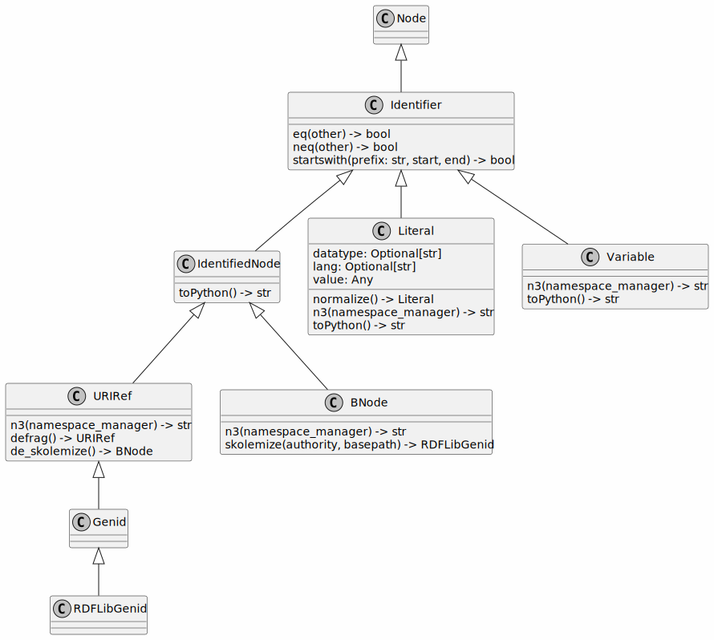

# RDF terms in rdflib

Terms are the kinds of objects that can appear in a RDFLib's graph's triples. Those that are part of core RDF concepts are: `IRIs`, `Blank Node` and `Literal`, the latter consisting of a literal value and either a [datatype](https://www.w3.org/TR/xmlschema-2/#built-in-datatypes) or an [RFC 3066](https://tools.ietf.org/html/rfc3066) language tag.

!!! info "Origins"
    RDFLib's class for representing IRIs/URIs is called "URIRef" because, at the time it was implemented, that was what the then current RDF specification called URIs/IRIs. We preserve that class name but refer to the RDF object as "IRI".

## Class hierarchy

All terms in RDFLib are sub-classes of the [`Identifier`][rdflib.term.Identifier] class. A class diagram of the various terms is:



Nodes are a subset of the Terms that underlying stores actually persist.

The set of such Terms depends on whether or not the store is formula-aware. Stores that aren't formula-aware only persist those terms core to the RDF Model but those that are formula-aware also persist the N3 extensions. However, utility terms that only serve the purpose of matching nodes by term-patterns will probably only be terms and not nodes.

## Python Classes

The three main RDF objects - *IRI*, *Blank Node* and *Literal* are represented in RDFLib by these three main Python classes:

### URIRef

An IRI (Internationalized Resource Identifier) is represented within RDFLib using the [`URIRef class`][rdflib.term.URIRef]. From [the RDF 1.1 specification's IRI section](https://www.w3.org/TR/rdf11-concepts/#section-IRIs):

```python
>>> from rdflib import URIRef
>>> uri = URIRef()  # doctest: +SKIP
Traceback (most recent call last):
  File "<stdin>", line 1, in <module>
TypeError: __new__() missing 1 required positional argument: 'value'
>>> uri = URIRef('')
>>> uri
rdflib.term.URIRef('')
>>> uri = URIRef('http://example.com')
>>> uri
rdflib.term.URIRef('http://example.com')
>>> uri.n3()
'<http://example.com>'
```

### BNodes

In RDF, a blank node (also called BNode) is a node in an RDF graph representing a resource for which an IRI or literal is not given. The resource represented by a blank node is also called an anonymous resource. According to the RDF standard, a blank node can only be used as subject or object in a triple, although in some syntaxes like Notation 3 it is acceptable to use a blank node as a predicate. If a blank node has a node ID (not all blank nodes are labelled in all RDF serializations), it is limited in scope to a particular serialization of the RDF graph, i.e. the node p1 in one graph does not represent the same node as a node named p1 in any other graph  -- [wikipedia](http://en.wikipedia.org/wiki/Blank_node)

See the [`BNode`][rdflib.term.BNode] class' documentation.

```python
>>> from rdflib import BNode
>>> bn = BNode()
>>> bn  # doctest: +SKIP
rdflib.term.BNode('AFwALAKU0')
>>> bn.n3()  # doctest: +SKIP
'_:AFwALAKU0'
```

### Literals

Literals are attribute values in RDF, for instance, a person's name, the date of birth, height, etc. and are stored using simple data types, e.g. *string*, *double*, *dateTime* etc. This usually looks something like this:

```python
name = Literal("Nicholas")  # the name 'Nicholas', as a string

age = Literal(39, datatype=XSD.integer)  # the number 39, as an integer
```

A slightly special case is a *langString* which is a *string* with a language tag, e.g.:

```python
name = Literal("Nicholas", lang="en")  # the name 'Nicholas', as an English string
imie = Literal("Mikołaj", lang="pl")  # the Polish version of the name 'Nicholas'
```

Special literal types indicated by use of a custom IRI for a literal's `datatype` value, for example the [GeoSPARQL RDF standard](https://opengeospatial.github.io/ogc-geosparql/geosparql11/spec.html#_geometry_serializations) invents a custom datatype, `geoJSONLiteral` to indicate [GeoJSON geometry serlializations](https://opengeospatial.github.io/ogc-geosparql/geosparql11/spec.html#_rdfs_datatype_geogeojsonliteral) like this:

```python
GEO = Namespace("http://www.opengis.net/ont/geosparql#")

geojson_geometry = Literal(
    '''{"type": "Point", "coordinates": [-83.38,33.95]}''',
    datatype=GEO.geoJSONLiteral
```

See the [`Literal`][rdflib.term.Literal] class' documentation, followed by notes on Literal from the [RDF 1.1 specification 'Literals' section](https://www.w3.org/TR/rdf11-concepts/#section-Graph-Literal).

A literal in an RDF graph contains one or two named components.

All literals have a lexical form being a Unicode string, which SHOULD be in Normal Form C.

Plain literals have a lexical form and optionally a language tag as defined by [RFC 3066](https://tools.ietf.org/html/rfc3066), normalized to lowercase. An exception will be raised if illegal language-tags are passed to [\_\_new\_\_()][rdflib.term.Literal.__new__].

Typed literals have a lexical form and a datatype URI being an RDF URI reference.

!!! abstract "Language vs. locale"
    When using the language tag, care must be taken not to confuse language with locale. The language tag relates only to human language text. Presentational issues should be addressed in end-user applications.

!!! quote "Case sensitive"
    The case normalization of language tags is part of the description of the abstract syntax, and consequently the abstract behaviour of RDF applications. It does not constrain an RDF implementation to actually normalize the case. Crucially, the result of comparing two language tags should not be sensitive to the case of the original input. -- [RDF Concepts and Abstract Syntax](http://www.w3.org/TR/rdf-concepts/#section-Graph-URIref)

#### Common XSD datatypes

Most simple literals such as *string* or *integer* have XML Schema (XSD) datatypes defined for them, see the figure below. Additionally, these XSD datatypes are listed in the [XSD Namespace class][rdflib.namespace.XSD] that ships with RDFLib, so many Python code editors will prompt you with autocomplete for them when using it.

Remember, you don't *have* to use XSD datatypes and can always make up your own, as GeoSPARQL does, as described above.


#### Python conversions

RDFLib Literals essentially behave like unicode characters with an XML Schema datatype or language attribute.

The class provides a mechanism to both convert Python literals (and their built-ins such as time/date/datetime) into equivalent RDF Literals and (conversely) convert Literals to their Python equivalent. This mapping to and from Python literals is done as follows:

| XML Datatype | Python type |
|--------------|-------------|
| None | None [^1] |
| xsd:time | time [^2] |
| xsd:date | date |
| xsd:dateTime | datetime |
| xsd:string | None |
| xsd:normalizedString | None |
| xsd:token | None |
| xsd:language | None |
| xsd:boolean | boolean |
| xsd:decimal | Decimal |
| xsd:integer | long |
| xsd:nonPositiveInteger | int |
| xsd:long | long |
| xsd:nonNegativeInteger | int |
| xsd:negativeInteger | int |
| xsd:int | long |
| xsd:unsignedLong | long |
| xsd:positiveInteger | int |
| xsd:short | int |
| xsd:unsignedInt | long |
| xsd:byte | int |
| xsd:unsignedShort | int |
| xsd:unsignedByte | int |
| xsd:float | float |
| xsd:double | float |
| xsd:base64Binary | base64 |
| xsd:anyURI | None |
| rdf:XMLLiteral | Document (xml.dom.minidom.Document [^3] |
| rdf:HTML | DocumentFragment (xml.dom.minidom.DocumentFragment) |

[^1]: plain literals map directly to value space
[^2]: Date, time and datetime literals are mapped to Python instances using the RDFlib xsd_datetime module, that is based on the [isodate](http://pypi.python.org/pypi/isodate/) package).
[^3]: this is a bit dirty - by accident the `html5lib` parser produces `DocumentFragments`, and the xml parser `Documents`, letting us use this to decide what datatype when round-tripping.

An appropriate data-type and lexical representation can be found using `_castPythonToLiteral`, and the other direction with `_castLexicalToPython`.

All this happens automatically when creating `Literal` objects by passing Python objects to the constructor, and you never have to do this manually.

You can add custom data-types with [`bind()`][rdflib.term.bind], see also [`custom_datatype example`][examples.custom_datatype]
